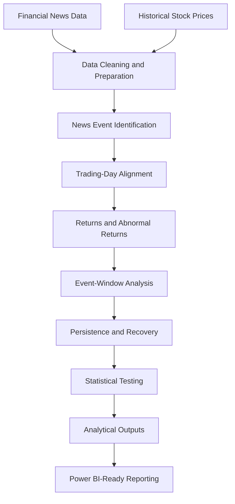

# 📈 Stock Market Reaction to Major News Events

### An Event-Based Analysis of Market Reaction, Persistence, and Recovery

> **Objective:** Investigate how stock prices behave around major business news events, whether initial reactions persist, and how prices recover after large movements.

## 📌 Project Overview

Financial news can coincide with substantial movements in stock prices. This project analyses historical news and market data to investigate stock reactions, persistence, and recovery patterns over subsequent trading days.

The analysis focuses on observable relationships rather than assuming that news events directly cause price movements.

## 🎯 Business Questions

- How do stocks react around major news events?
- Do abnormal returns persist over the following 10 trading days?
- How do reactions vary across companies and event categories?
- Do large price drops reverse, and do large jumps continue or reverse?
- How do event-window returns compare with ordinary trading-day movements?

## 🔄 Analytical Workflow



## 🧰 Tools and Technologies

| Tool                | Purpose                                   |
| ------------------- | ----------------------------------------- |
| Python              | Data processing and analysis              |
| Pandas              | Data cleaning and transformation          |
| NumPy               | Numerical calculations                    |
| Matplotlib          | Data visualisation                        |
| Jupyter Notebook    | Analysis and documentation                |
| Statistical testing | Evaluate observed patterns                |
| Power BI            | Further exploration of analytical outputs |

## 📊 Key Analytical Components

### 1. Abnormal Returns

Compare individual stock returns with a market benchmark to examine movements beyond the benchmark's daily return.

### 2. Cumulative Abnormal Returns (CAR)

Evaluate cumulative abnormal returns across an event window extending from Day -1 through Day +10.

### 3. Reaction Persistence

Investigate whether the initial market reaction remains observable over subsequent trading days.

### 4. Price Recovery

Examine the subsequent behaviour of large upward and downward price movements.

### 5. Company and Event-Category Comparison

Compare return patterns across companies and keyword-based business-event categories.

### 6. Statistical Evaluation

Use statistical tests and multiple-testing adjustment to assess the strength of observed patterns.

## 🗂️ Repository Structure

```text
stock-market-reaction-to-major-news-events/
│
├── README.md
├── Project_Stock_market.ipynb
└── Project_Stock_market.html
```

## 💡 Skills Demonstrated

- Financial data analysis
- Data cleaning and transformation
- Exploratory data analysis (EDA)
- Return and abnormal-return calculations
- Event-window analysis
- Statistical hypothesis testing
- Data visualisation
- Analytical reporting and business intelligence preparation

## ⚠️ Limitations

- News observation timestamps may not match the exact time information became available to investors.
- Daily closing prices limit intraday analysis.
- The market benchmark does not account for every company-specific risk factor.
- Overlapping events and keyword-based classification can affect the results.
- Findings are specific to the selected sample and observation period.

The analysis identifies observational patterns and does not establish causation or provide investment advice.

## 🏁 Conclusion

This project demonstrates a structured financial analytics workflow, from preparing financial news and stock-price data to evaluating market reactions, persistence, recovery, and statistical evidence.

The goal is to translate financial data into interpretable findings that can support further analysis and business intelligence reporting.

